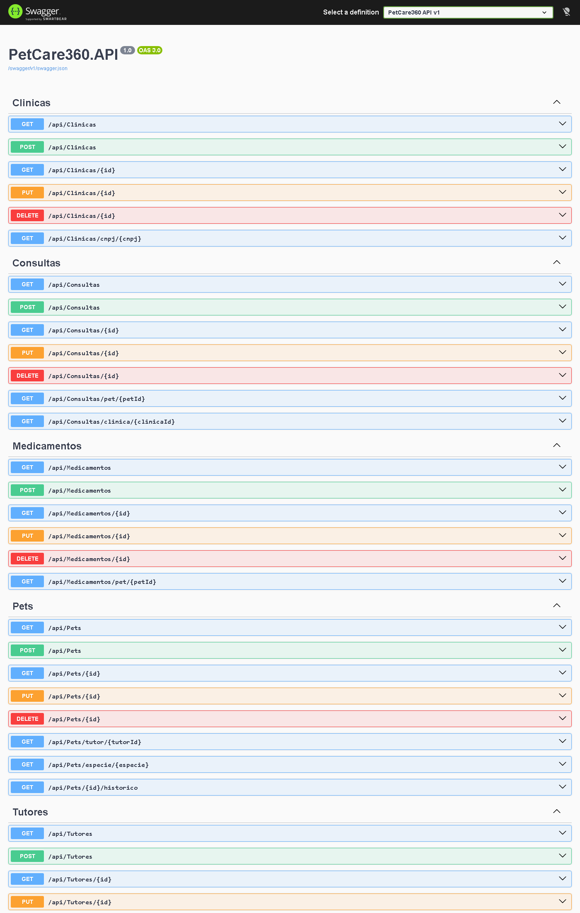
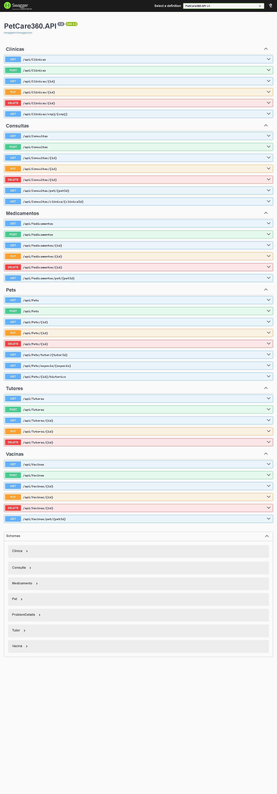

# PetCare 360 — API .NET

API .NET do projeto **PetCare 360**, que estou desenvolvendo no Challenge 2026 da FIAP em parceria com a CLYVO VET.

A ideia é resolver um problema que qualquer dono de pet conhece: hoje a saúde do bicho vive aos pedaços. Tutor vai na clínica só quando o pet adoece, esquece vacina, perde a carteirinha, troca de clínica e o histórico fica perdido. O PetCare 360 tenta juntar tutor, pet, clínica e atendimentos num lugar só — cadastros, consultas, vacinas, medicamentos e o histórico completo de cada animal.

Esta API é o núcleo de cadastro: toda informação principal passa por aqui antes de ir pro app mobile.

## Quem fez

Sou o Murillo, da turma **2TDSPW** (2º ano de ADS na FIAP). Nesse grupo eu fiquei responsável pelas APIs do projeto (.NET e Java). Os outros integrantes:

- **Kauan** cuida do banco Oracle (modelagem, DDL, procedures)
- **João Vitor** faz o app mobile em React Native e o deploy na Azure

## O que essa API faz

CRUD completo de 6 entidades:

- `Tutor` — quem é responsável pelo pet
- `Pet` — o animal em si
- `Clinica` — onde os atendimentos acontecem
- `Consulta` — visita veterinária
- `Vacina` — registro de vacinação
- `Medicamento` — prescrição/tratamento

Cada uma tem GET, POST, PUT e DELETE, mais umas rotas extras (tipo "lista todas as vacinas desse pet" ou "me dá o histórico completo desse animal").

## Tecnologias

.NET 10 com ASP.NET Core, Entity Framework Core 10, Oracle 19c (banco da FIAP) e Swagger pra documentação. Tudo Code-First — a estrutura das tabelas é definida pelas classes do C# e o EF Core gera o SQL.

---

# Como instalar e executar

> ⚠️ **Importante:** Esta API usa **Code-First com EF Core Migrations**. Isso significa que **você não precisa criar tabela nenhuma manualmente** — o próprio EF cria toda a estrutura do banco pra você no Passo 4.

## Pré-requisitos

Você precisa ter instalado:

1. **.NET 10 SDK** — baixe em https://dotnet.microsoft.com/download
2. **Acesso a um banco Oracle** — pode ser:
   - Oracle da FIAP (`oracle.fiap.com.br:1521/ORCL`) com seu usuário/senha de aluno
   - Oracle XE local (`localhost:1521/XEPDB1`)
   - Qualquer outra instância Oracle 19c+ que você tenha acesso

Pra conferir se o .NET tá instalado, abre o PowerShell e roda:

```powershell
dotnet --version
```

Tem que aparecer algo tipo `10.0.x`.

---

## Passo 1 — Clonar o repositório

```powershell
git clone https://github.com/MurilloFernandesCarapia/Challenge.NET.git
cd Challenge.NET
```

## Passo 2 — Instalar a ferramenta do EF Core (uma vez só na sua máquina)

Essa ferramenta é o que aplica as migrations no banco. Se você nunca usou EF antes, roda isso:

```powershell
dotnet tool install --global dotnet-ef
```

Se já tem instalado, ele vai dizer "tool already installed", o que é normal. **Feche e reabra o PowerShell** depois desse comando pra atualizar o PATH.

Pra confirmar que funcionou:

```powershell
dotnet ef --version
```

## Passo 3 — Configurar suas credenciais do Oracle

Abre o arquivo `PetCare360.API/appsettings.json` e edita a connection string com **suas credenciais**:

```json
{
  "ConnectionStrings": {
    "OracleConnection": "User Id=SEU_USUARIO;Password=SUA_SENHA;Data Source=oracle.fiap.com.br:1521/ORCL;"
  }
}
```

Substitua:
- `SEU_USUARIO` pelo seu usuário Oracle (ex: o seu RM da FIAP)
- `SUA_SENHA` pela sua senha
- `Data Source` se você usa outro servidor (ex: `localhost:1521/XEPDB1` pro Oracle XE local)

> 💡 Se o banco que você vai apontar tiver outras tabelas com nomes começando com `TB_` (TB_TUTOR, TB_PET, etc), apague elas antes — o EF vai criar tudo do zero.

## Passo 4 — Criar as tabelas no banco (aplicar as migrations)

Esse é o passo mágico. Roda na raiz do projeto:

```powershell
dotnet ef database update --project PetCare360.API
```

O que esse comando faz:

1. Conecta no Oracle usando as credenciais do `appsettings.json`
2. Cria a tabela de controle `__EFMigrationsHistory`
3. Executa as 2 migrations existentes (`InitialCreate` e `AjusteModelo`)
4. Resultado: **6 tabelas criadas** com chaves estrangeiras, índices e constraints prontos:
   - `TB_TUTOR`, `TB_PET`, `TB_CLINICA`, `TB_CONSULTA`, `TB_VACINA`, `TB_MEDICAMENTO`

Se rodar sem erros, tá tudo pronto. Se der erro de conexão, confere as credenciais do Passo 3.

## Passo 5 — Restaurar pacotes e rodar a API

```powershell
dotnet restore
dotnet run --project PetCare360.API
```

O console vai mostrar algo tipo:

```
Now listening on: http://localhost:5260
Now listening on: https://localhost:7031
```

Abre o navegador em uma dessas URLs adicionando `/swagger`:

- **HTTP:** http://localhost:5260/swagger
- **HTTPS:** https://localhost:7031/swagger

Pronto, o Swagger tá aberto e você pode testar todos os endpoints.

---

# Como testar no Swagger (roteiro pra demonstrar tudo funcionando)

Segue essa ordem pra ver a API funcionando ponta-a-ponta. Os IDs retornados nos POSTs (1, 2, 3...) você usa nos passos seguintes.

### 1. Criar um tutor — `POST /api/Tutores`

```json
{
  "nmTutor": "Murillo Silva",
  "cpf": "123.456.789-00",
  "email": "murillo@email.com",
  "telefone": "(11) 99999-1111",
  "endereco": "Rua dos Pets, 360"
}
```

### 2. Criar uma clínica — `POST /api/Clinicas`

```json
{
  "nmClinica": "Clínica Pet Center",
  "cnpj": "12.345.678/0001-99",
  "endereco": "Av. Paulista, 1500",
  "telefone": "(11) 3000-0001",
  "email": "contato@petcenter.com"
}
```

### 3. Criar um pet (usando o `idTutor` do passo 1) — `POST /api/Pets`

```json
{
  "nmPet": "Rex",
  "especie": "Cachorro",
  "raca": "Labrador",
  "dtNascimento": "2020-05-10T00:00:00",
  "peso": 28.5,
  "idTutor": 1
}
```

### 4. Criar uma consulta — `POST /api/Consultas`

```json
{
  "dtConsulta": "2026-05-20T14:00:00",
  "descricao": "Consulta de rotina",
  "diagnostico": "Pet saudável",
  "idPet": 1,
  "idClinica": 1
}
```

### 5. Cadastrar uma vacina — `POST /api/Vacinas`

```json
{
  "nmVacina": "V10",
  "fabricante": "Zoetis",
  "dtAplicacao": "2026-05-20T00:00:00",
  "dtProximaDose": "2027-05-20T00:00:00",
  "idPet": 1,
  "idConsulta": 1
}
```

### 6. Cadastrar um medicamento — `POST /api/Medicamentos`

```json
{
  "nmMedicamento": "Vermífugo",
  "dosagem": "1 comprimido",
  "frequencia": "A cada 6 meses",
  "dtInicio": "2026-05-20T00:00:00",
  "dtFim": "2026-05-20T00:00:00",
  "idPet": 1,
  "idConsulta": 1
}
```

### 7. Ver o histórico completo do pet — `GET /api/Pets/1/historico`

Esse endpoint traz o pet com **todas as consultas, vacinas e medicamentos** juntos. É o coração da API.

### 8. Testar erros propositais (mostra que as validações funcionam)

- `GET /api/Tutores/999` → retorna **404 NotFound** ("Tutor não encontrado")
- `POST /api/Pets` com `idTutor: 999` (tutor inexistente) → retorna **400 BadRequest**
- `DELETE /api/Tutores/1` (tutor com pets vinculados) → retorna **erro** porque a regra de FK proíbe deletar tutores que têm pets cadastrados

---

# Prints do Swagger

Pra ter uma ideia do que esperar antes de rodar, segue como a interface fica:

### Visão geral — tela inicial do Swagger

Logo que abre `/swagger`, os 6 grupos de entidades aparecem agrupados, cada um listando seus endpoints (GET/POST/PUT/DELETE):



### Página completa — endpoints + Schemas

A página inteira incluindo a seção **Schemas** no final, que mostra a estrutura JSON de cada entidade (Clinica, Consulta, Medicamento, Pet, Tutor, Vacina, ProblemDetails):



---

# Endpoints disponíveis

A documentação interativa completa está no Swagger depois de rodar a aplicação. Resumo das rotas:

### Tutores — `/api/Tutores`
- `GET /api/Tutores` — lista todos
- `GET /api/Tutores/{id}` — busca por ID
- `POST /api/Tutores` — cria
- `PUT /api/Tutores/{id}` — atualiza
- `DELETE /api/Tutores/{id}` — remove

### Pets — `/api/Pets`
- `GET /api/Pets` — lista todos
- `GET /api/Pets/{id}` — busca por ID
- `GET /api/Pets/tutor/{tutorId}` — lista pets de um tutor
- `GET /api/Pets/especie/{especie}` — filtra por espécie
- `GET /api/Pets/{id}/historico` — pet + consultas + vacinas + medicamentos ⭐
- `POST /api/Pets` — cria
- `PUT /api/Pets/{id}` — atualiza
- `DELETE /api/Pets/{id}` — remove

### Clínicas — `/api/Clinicas`
- `GET /api/Clinicas` — lista todas
- `GET /api/Clinicas/{id}` — busca por ID
- `GET /api/Clinicas/cnpj/{cnpj}` — busca por CNPJ
- `POST /api/Clinicas` — cria
- `PUT /api/Clinicas/{id}` — atualiza
- `DELETE /api/Clinicas/{id}` — remove

### Consultas — `/api/Consultas`
- `GET /api/Consultas` — lista todas
- `GET /api/Consultas/{id}` — busca por ID
- `GET /api/Consultas/pet/{petId}` — consultas de um pet
- `GET /api/Consultas/clinica/{clinicaId}` — consultas de uma clínica
- `POST /api/Consultas` — cria
- `PUT /api/Consultas/{id}` — atualiza
- `DELETE /api/Consultas/{id}` — remove

### Vacinas — `/api/Vacinas`
- `GET /api/Vacinas` — lista todas
- `GET /api/Vacinas/{id}` — busca por ID
- `GET /api/Vacinas/pet/{petId}` — vacinas de um pet
- `POST /api/Vacinas` — cria
- `PUT /api/Vacinas/{id}` — atualiza
- `DELETE /api/Vacinas/{id}` — remove

### Medicamentos — `/api/Medicamentos`
- `GET /api/Medicamentos` — lista todos
- `GET /api/Medicamentos/{id}` — busca por ID
- `GET /api/Medicamentos/pet/{petId}` — medicamentos de um pet
- `POST /api/Medicamentos` — cria
- `PUT /api/Medicamentos/{id}` — atualiza
- `DELETE /api/Medicamentos/{id}` — remove

**Total: 33 endpoints** (14 GETs + 6 POSTs + 6 PUTs + 6 DELETEs + 1 histórico).

---

# Como os dados se ligam

```
TB_TUTOR (1) ─────┐
                  │ N
                  ▼
TB_PET (1) ──┬──→ TB_CONSULTA (N) ←── TB_CLINICA (1)
             │
             ├──→ TB_VACINA (N)
             │
             └──→ TB_MEDICAMENTO (N)
```

Regras de integridade que ficaram explícitas no banco:

- Não dá pra apagar um tutor que ainda tem pets cadastrados (apaga os pets primeiro)
- Não dá pra apagar uma clínica que tem histórico de consultas (preserva histórico)
- CPF e email do tutor são únicos no sistema
- CNPJ da clínica é único

---

# Estrutura do código

```
Challenge.NET/
├── PetCare360.API/
│   ├── Controllers/                ← 6 endpoints (Tutores, Pets, Clinicas, Consultas, Vacinas, Medicamentos)
│   ├── Models/                     ← classes do domínio (Tutor, Pet, Clinica, Consulta, Vacina, Medicamento)
│   ├── Data/
│   │   └── AppDbContext.cs         ← configuração do EF Core (Fluent API + relacionamentos)
│   ├── Migrations/                 ← histórico de mudanças no banco
│   │   ├── 20260512232200_InitialCreate.cs
│   │   └── 20260520025529_AjusteModelo.cs
│   ├── Properties/
│   │   └── launchSettings.json     ← perfis de execução (http/https)
│   ├── Program.cs                  ← entrada e configuração da API
│   ├── appsettings.json            ← config (connection string Oracle)
│   └── PetCare360.API.csproj       ← dependências do projeto
├── docs/
│   └── screenshots/                ← prints do Swagger pra documentação
├── .gitignore
├── PetCare360.API.slnx             ← solução .NET
└── README.md                       ← este arquivo
```

---

# Resolução de problemas comuns

**"dotnet-ef" não é reconhecido como comando**
> Você não instalou o tool. Volte ao Passo 2.

**Erro `ORA-12541: TNS:no listener` ou `ORA-12170: TNS:Connect timeout`**
> A connection string tá errada ou o servidor Oracle não tá acessível. Confere o `Data Source` no `appsettings.json`.

**Erro `ORA-01017: invalid username/password`**
> Usuário ou senha errados no `appsettings.json`. Confere as credenciais.

**Erro `ORA-00955: name is already used by an existing object`**
> O banco já tem alguma tabela com nome conflitante (`TB_PET`, `TB_TUTOR`, etc). Apaga elas no banco antes de rodar as migrations.

**Swagger abre mas dá 500 ao testar endpoints**
> Você esqueceu de rodar `dotnet ef database update` no Passo 4. Sem isso as tabelas não existem.

**A página `/swagger` dá 404**
> O perfil de execução tá em produção. Garanta que `ASPNETCORE_ENVIRONMENT` esteja como `Development` (o `launchSettings.json` do projeto já faz isso por padrão).

---

# Sobre o projeto

Esse é um trabalho de faculdade do meu 2º ano de ADS. Não é production-ready — não tem autenticação, rate limiting, cache distribuído, nada disso. O foco era demonstrar domínio dos conceitos da matéria de **Advanced Business Development with .NET** (Web API, EF Core, Oracle, REST, OpenAPI).

Se você é o professor avaliando isso: bem-vindo, espero ter feito direito 😄

---

Murillo · 2TDSPW · FIAP · Maio de 2026
